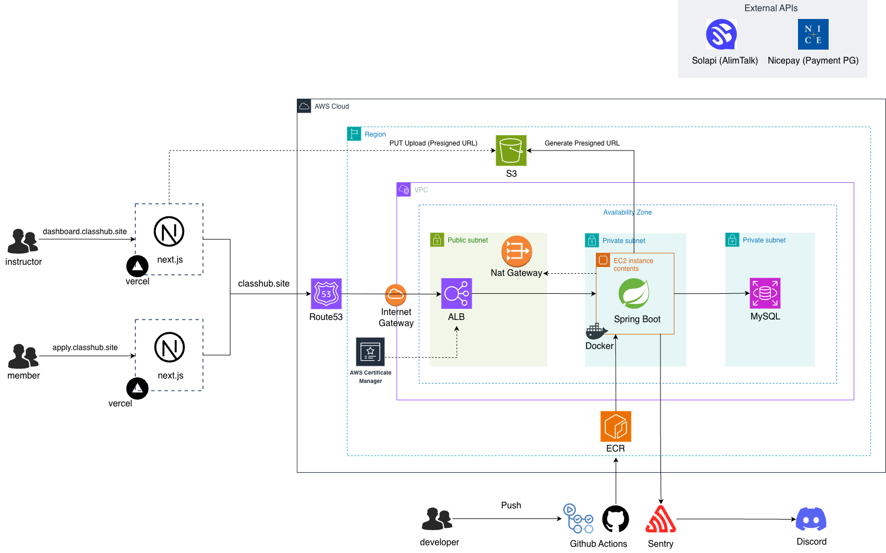
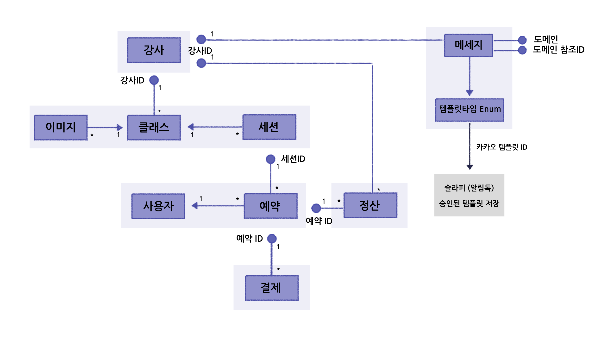

# 🚀 Class Hub (클래스 허브) - Backend

## 📖 프로젝트 소개
**Class Hub**는 강사와 수강생을 이어주는 원데이 클래스 통합 예약 및 관리 플랫폼입니다.
강사는 복잡한 예약, 결제, 수강생 안내(알림톡) 등의 반복 업무를 자동화하여 클래스 본연에 집중할 수 있고, 수강생은 모바일 웹 환경에서 빠르고 편리하게 클래스를 탐색하고 예약할 수 있습니다.

본 백엔드 시스템은 안정적인 예약 처리와 비동기 메시징 처리에 중점을 두고 설계되었습니다.

### 📌 프로젝트 개요
- **진행 기간:** 2026.01 ~ 2026.02
- **참여 인원:** 총 3명 (기획 1명, 개발 2명)
- **담당 직무:** Frontend, Backend, Infrastructure 전반 담당

---

## ✨ 서비스 주요 기능 (Features)

### 🧑‍🏫 강사 센터 (대시보드)
- **클래스 및 일정 관리:** 원데이 클래스 개설, 세션(날짜/시간) 등록 및 정원 설정
- **예약 내역 관리:** 실시간 예약 현황 조회, 승인/취소 처리 및 환불
- **자동화된 수강생 안내:** 템플릿 기반 카카오 알림톡/SMS 발송 (예약 확정, 수업 1일전 리마인드 등)
- **출석 체크:** 오프라인 클래스 진행 시 수강생 출석 여부 관리

### 👩‍🎓 수강생 서비스 (모바일 웹)
- **간편 예약 체계:** 클래스 코드 혹은 링크를 통한 직관적인 세션 선택 및 예약 
- **결제 연동:** 카카오페이, 토스페이먼츠 등 간편 결제 지원
- **실시간 잔여 좌석 확인:** 동시 예약을 방지하는 실시간 정원 조회 체계
- **내 예약 조회:** 예약 조회 및 시작 12시간 전까지 취소 기능 (자동 환불 연동)

---

## 🏗 시스템 아키텍처 (System Architecture)
안정적이고 확장 가능한 백엔드 설계를 위해 AWS 인프라와 CI/CD 파이프라인을 구축했습니다.



### 🛠 주요 기술 스택
- **Language**: Java 17
- **Framework**: Spring Boot 3.5.9
- **ORM & DB**: Spring Data JPA, Hibernate, MySQL 8.0, H2 (Local)
- **Security**: Spring Security, JWT (JSON Web Token)
- **Notification**: Solapi (Kakao Alimtalk & SMS)
- **Storage**: AWS S3
- **DevOps**: GitHub Actions, Docker, AWS EC2, AWS ECR

---

## 🗄 ERD (Entity-Relationship Diagram)
유연한 클래스 운영과 예약 확장을 고려한 도메인 데이터베이스 설계입니다.



---

## 💡 핵심 아키텍처 및 구현 포인트

### 1. 동시성 제어 및 트랜잭션 관리 (예약 시스템)
선착순 혹은 동시 다발적인 예약 요청 시 발생할 수 있는 **초과 예약(Overbooking)** 문제를 방지하기 위해 정교한 락(Lock) 메커니즘을 적용했습니다.
- **Pessimistic Lock (비관적 락)**: `findByIdWithLock(@Lock(LockModeType.PESSIMISTIC_WRITE))`를 적용하여 세션 잔여 좌석을 차감할 때 데이터 무결성을 보장합니다.
- **선언적 트랜잭션 (`@Transactional`)**: 사용자 가입, 세션 인원 차감, 예약 레코드 생성을 하나의 원자적(Atomic) 작업 단위로 묶어 예외 발생 시 안전한 롤백을 보장합니다.
- **예약 자동 취소 스케줄링**: 예약 후 결제가 지연되는 상태(PENDING)를 막기 위해 `@Scheduled`를 활용, 15분 경과 시 예약을 자동 취소하고 인원을 원복하는 로직을 구현했습니다.

### 2. 비동기 메시지(알림톡) 알림 시스템의 분리 설계
결제 및 예약 도메인과 알림(Message) 도메인 간의 의존성을 분리하고 객체지향적 설계를 적용했습니다.
- **Strategy Pattern (전략 패턴)**: `MessageSender` 인터페이스를 제공하고, 상황별(예약확정, 1일전 리마인드 등) 구현 클래스를 분리하여 OCP(개방-폐쇄 원칙)를 준수합니다.
- **Client Interface 분리**: `MessageClient` 인터페이스를 통해 외부 공급자(Solapi 등)에 대한 결합도를 낮추었습니다 (`@ConditionalOnProperty` 활용).
- **Webhook을 통한 비동기 상태 추적**: 알림톡 발송 완료 여부를 파악하기 위해 웹훅을 수신하고, `MessageWebhookService`를 통해 DB의 메시지 상태(`SENT`, `FAILED`)를 비동기로 업데이트합니다.

### 3. 결제 결과 누락 방지를 위한 이중 채널 구조
결제 과정에서 네트워크 오류, 브라우저 종료 등으로 인해 결제 결과가 서버에 정상적으로 전달되지 않는 결제 정합성 문제를 해결하기 위해 **결제 결과를 두 개의 채널로 처리하는 구조**를 설계했습니다.
- **Redirect 기반 결제 결과 처리**: 클라이언트 브라우저를 통해 일차적으로 결제 승인 결과를 전달받습니다.
- **Webhook 기반 서버 간 결제 결과 전달**: 외부 결제망(PG) 웹훅 이벤트를 수신하는 백엔드 API를 두어, 프론트엔드가 결과를 놓치더라도 백그라운드 서버 간 통신으로 결제가 누락 없이 처리되도록 이중화 구현을 하였습니다.

### 4. 클린한 RESTful API 제공
- 프론트엔드 프로젝트(사용자용, 관리자 대시보드용)에서 데이터를 안정적으로 소비할 수 있도록 **Swagger** (SpringDoc OpenAPI) 기반의 꼼꼼한 API 명세서를 제공합니다.

---

## 🔄 CI/CD 파이프라인 매커니즘

프로젝트는 명확한 브랜치 전략과 자동화된 파이프라인으로 무중단 배포를 목표로 합니다.

**[ 🚀 CI (Continuous Integration) ]**
- **트리거**: `develop` 혹은 `main` 브랜치에 PR(Pull Request) 생성 시
- **작업**: 단위 테스트 패스 (Test), Spring Boot JAR 빌드 검증 (Build)

**[ 🛳 CD (Continuous Deployment) ]**
- **트리거**: `main` 브랜치에 코드가 푸시(Push)될 때
- **작업**:
  1. 최신 코드로 서버 애플리케이션 빌드
  2. 도커(Docker) 이미지 빌드 및 AWS ECR 푸시
  3. 운영 운영 서버(AWS EC2)에서 최신 이미지를 가져와 컨테이너 재가동

---

## 📁 디렉토리 구조 (Domain-driven Architecture)

```text
com.cmc.classhub
 ┣ 📂 admin          # 관리자 대시보드 API
 ┣ 📂 instructor     # 강사 도메인
 ┣ 📂 message        # 알림 카카오톡/SMS 도메인 (전략 패턴 & 웹훅 적용)
 ┣ 📂 onedayClass    # 클래스 상품, 일정(세션) 도메인
 ┣ 📂 payment        # 간편 결제 연동 처라 도메인
 ┣ 📂 reservation    # 예약 엔진 도메인 (비관적 락 관리)
 ┣ 📂 member         # 사용자/수강생 도메인
 ┗ 📂 global         # 전역 예외 처리, Spring Security, AWS S3 등 공통 모듈
```

---

<div align="center">
  <p><b>Class Hub</b> - Making Your Classes Simple and Smart</p>
</div>
